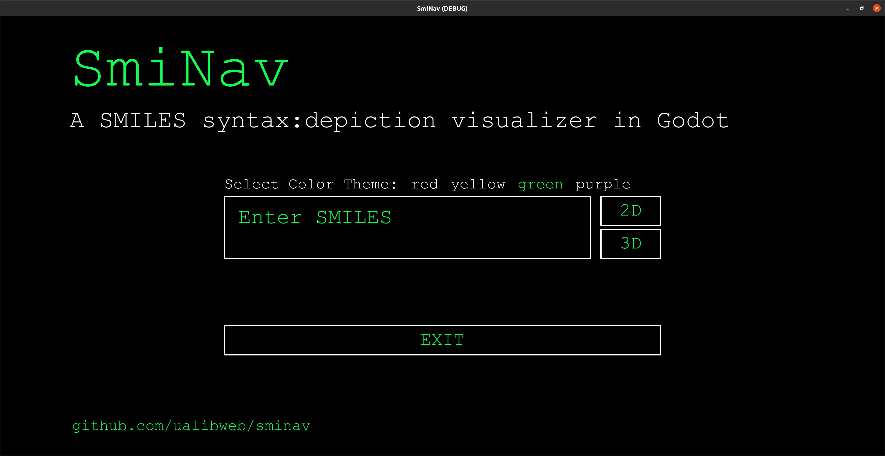
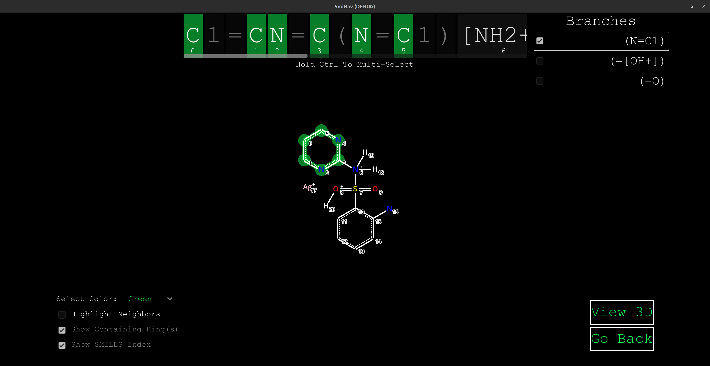
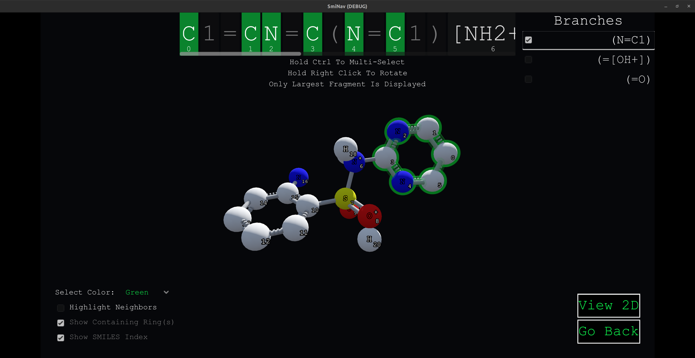

# SmiNav
### SMILES visualization with Godot

> [!CAUTION]
> We did this for fun and to learn how to create interfaces in Godot. This program is not thoroughly tested and there are likely to be a variety of SMILES parsing issues and edge-cases that do not visualize correctly. We do not have immediate plans to continue this project, though any feedback and bug reports are welcome.

SmiNav (SMILES Navigator) is a GUI visualizer for parts of the SMILES syntax (atoms, neighbors, and rings). It was inspired by Andrew Dalke's [smiview](https://hg.sr.ht/~dalke/smiview). It uses the [RDKit](https://www.rdkit.org/) library in Python to parse the SMILES string and return mol coordinates and properties that are then used to create a 2D or 3D visualization of the molecule. The visualization is done using the [Godot game engine](https://godotengine.org/).

> Please see the [Godot License](https://godotengine.org/license/)
> 
> Please see the [RDkit License]([https://github.com/rdkit/rdkit](https://github.com/rdkit/rdkit?tab=BSD-3-Clause-1-ov-file#readme))
>
> Please see the [SmiView by Andrew Dalke License](https://hg.sr.ht/~dalke/smiview/browse/LICENSE.txt?rev=tip)

To use SmiNav, input a SMILES string, then click the visualization dimension you wish to view. Upon clicking on an atom in the string, the corresponding atom in the depiction will then get highlighted. The reverse works as well; that is, click on an atom in the depiction and the corresponding atom in the SMILES string will get highlighted.

## Features
* 2D and 3D visualization of SMILES strings
* Interactive highlighting of atoms in the SMILES string and depiction
* Atom properties (e.g., charge, SMILES Index) are shown in the SMILES string and depiction
* Ring properties (e.g., aromaticity) and ring closures are shown in the SMILES string and depiction
* Branches of the SMILES string are shown in the depiction
* Highlighting of explicit hydrogens in the SMILES string and depiction

## Main Screen



## 2D



## 3D



## Installation of source code in godot

> [!NOTE]
> For the program to run, you must have Python 3.7 or greater installed and Python virtual environments installed.

1. Download the source code from the repository  
`git clone https://github.com/UA-Libraries-Research-Data-Services/SmiNav.git`
2. Open Godot and click on `Import`
3. Navigate to the `SmiNav` folder and click on `Open` on the `project.godot` file

### To run the program

In the Godot editor, click on the `Play` button to run `►` the program on the top right corner of the window.

## Exporting Binaries with Godot

To create standalone binaries of the SmiNav application for your operating system:

1. **Install Export Templates**:
   - In Godot, go to `Editor > Manage Export Templates` and download the official templates for your Godot version.

2. **Install Export Presets**:
   - Open your SmiNav project in Godot.
   - Go to `Project > Export`.
   - Click `Add` and select the platform you want to export for (e.g., Windows, Linux, MacOS).
   - Set the export path and other relevant options (e.g., binary name, icon, etc.).

3. **Configure Virtual Environment Requirements**:
   - Make sure that Python and RDKit dependencies are met as outlined in the section below.

4. **Export**:
   - Click `Export Project` to create the binary.
   - The output binary will be placed in the directory you specified in the export preset.

> **Note:** If the exported binary does not detect Python automatically, ensure your `.venv` folder exists and is properly configured in the application directory.

> **Important:** You must also move the `rdkit_script.py` file into the same directory as the exported binary for the program to work correctly.

---


## Advanced Installation

### Manually Setting Up a Virtual Environment

If you prefer to manually set up a virtual environment within the SmiNav folder, follow these steps:

1. **Create a Virtual Environment**:
   - Open a terminal or command prompt and navigate to the project directory.
   - Run the following command to create a virtual environment (Windows users should replace `python3` with `python`):
     ```bash
     python3 -m venv .venv
     ```
   - This will create a new directory called `.venv` in your project folder. This directory contains a local Python environment that is isolated from your system-wide Python installation.

2. **Activate the Virtual Environment**:
   - Once the virtual environment is created, activate it:
     - On Ubuntu/Debian:
       ```bash
       source .venv/bin/activate
       ```
     - On Windows:
       ```cmd
       .venv\Scripts\activate
       ```

3. **Install Dependencies**:
    - With the virtual environment activated, install the required Python packages:
      ```bash
      pip install rdkit
      ```

## FAQ

1. If Python dependencies installation fails with SmiNav, delete the created `.venv` folder before trying again. Typical failure is not having Python 3 or Python venv installed.

2. Testing - We last tested SmiNav with Godot v.4.2.1, RDKit 2023.09.05, and Python 3.11. See also the Godot minimum requirements: https://docs.godotengine.org/en/stable/about/system_requirements.html

## Known Limitations

1. In the 2D depictions, stereochemistry is not shown
2. Currently only the atom Symbols are interactive in the SMILES string
3. Only explicit hydrogens are shown in the depictions. Valences are not automatically filled with H (e.g., an alcohol functional group would show up as -O, and not -OH)
4. Does not support individual explicit hydrogens in the SMILES string (e.g., [H] or [H][O][H]). However, explicit hydrogens are supported when attached to atoms within brackets (e.g., [CH4] as an atom property)

